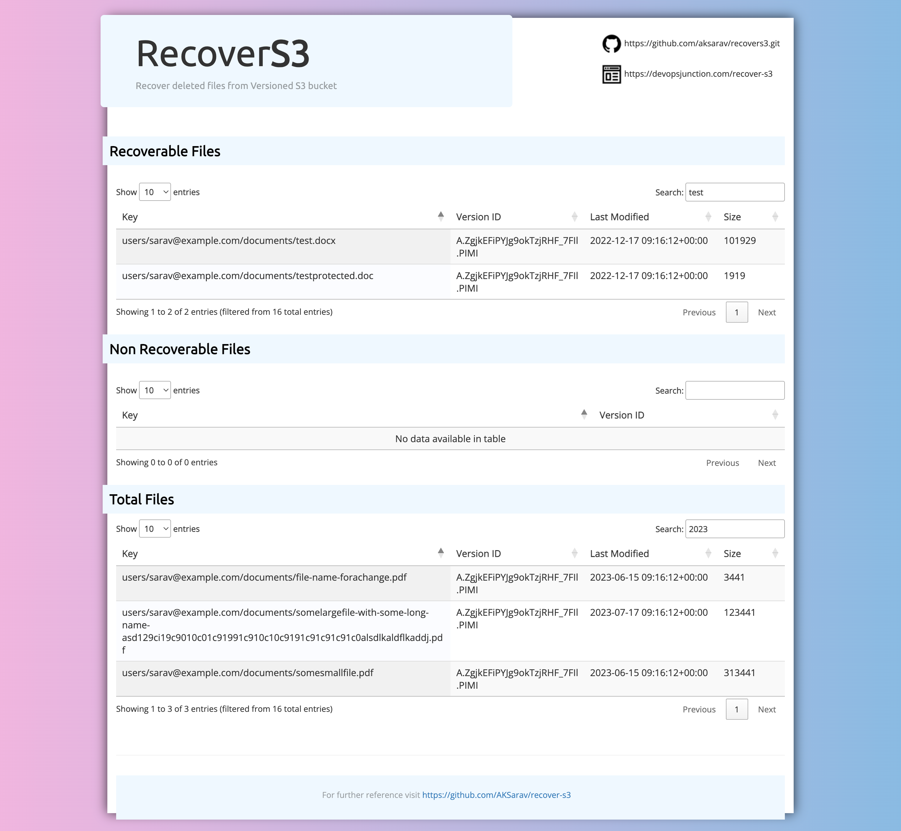

## Recover S3 :recycle:

RecoverS3 is designed to recover files (objects) from Versioned S3 Buckets that have been soft deleted (Delete Marker) 

RecoverS3 is a command line tool that can be used to recover files from S3 buckets that have versioning enabled

It tracks the delete markers in the given S3 bucket matching the `prefix` ( directory structure) and perform the recovery

This tool is built with Python 3 and Boto3 and it is built with concurrency to speed up the recovery process

RecoverS3 also has a beautiful reporting feature that generates a HTML report designed with `Bootstrap`, `datatable` and `Jquery` to make your report searchable, sortable and easy to find every single file that you are looking for



Before we get into the details of how RecoverS3 works, let's understand how S3 versioning works and how `deletemarker` works

&nbsp;
### What is S3 deletemarker and how it works :bulb:


In Amazon S3 (Simple Storage Service), a "DeleteMarker" is a unique object that represents the deletion of a versioned object in a bucket. When versioning is enabled for an S3 bucket, each object uploaded to the bucket will have multiple versions, and when you delete an object, S3 doesn't remove it immediately. Instead, it inserts a `DeleteMarker` as the latest version of the object to indicate that the object has been deleted.

Here's how DeleteMarkers work in S3:

`Versioning:` Before DeleteMarkers can be used, you need to enable versioning for the S3 bucket. Once versioning is enabled, S3 will keep track of multiple versions of each object in the bucket.

`Deletion:` When you delete an object in a versioned bucket, instead of physically removing the object, S3 inserts a new DeleteMarker object with the same key as the deleted object. The DeleteMarker's presence indicates that there was a previous version of the object that has been deleted.

`Hiding the object:` When a DeleteMarker is in place, it acts as a placeholder for the deleted object, making it appear as if the object still exists. However, you won't be able to retrieve the object using regular GET requests.

`List operations:` When listing objects in the bucket, S3 includes DeleteMarkers in the list along with the active versions of objects. This way, you can see that an object with a specific key was deleted and when it was deleted.

`Permanent deletion:` If you want to permanently delete an object along with its versions (including the DeleteMarker), you need to use a specific delete operation called "Delete Object" with the object version ID. Deleting the object version containing the DeleteMarker will effectively remove all associated versions of that object, including the DeleteMarker itself.

`S3 Lifecycle policies:` You can configure lifecycle policies in S3 to automatically remove older versions of objects and their corresponding DeleteMarkers after a specific duration.

DeleteMarkers are essential for keeping track of the version history of objects in versioned S3 buckets. They provide a way to understand when and which versions of an object were deleted, allowing for more precise control over the data stored in the bucket.

&nbsp;
### How RecoverS3 deal with DeleteMarker :thinking:

As you have read and understood how `Deletion` and `DeleteMarker` and `Version Control` works on S3 bucket with Versioning enabled

In a versioned bucket, when we delete an object/file it simply means we are adding a `Delete Marker` as the latest version of that document - in other words we refer it as a soft delete

Now RecoverS3 tracks all these delete markers in the given S3 bucket matching the `prefix` ( directory structure) and validate if they are recoverable or not

In a versioned S3 bucket. you can directly delete the non current version of the object, which could be the file itself. - We refer this as permanent deletion

In this case, when a source file object is removed and delete marker is only present. we cannot recover that file

So recoverS3 validates this scneario before starting the recovery

If the source file does not exist, we cannot recover the file and it would be listed as `Non Recoverable` in the generated report.

All other recoverables files are kept under `Recoverable` table 

You can use the `-dryrun` option to generate a detailed report on what can be recovered and what cannot be , before proceeding with the actual recovery

&nbsp;
### Performance :rocket:

recoverS3 is built with threading model to speed up the process. As part of benchmarking, we have recovered 10000 files in 8 minutes.

The speed of the script depends on the number of files that you are trying to recover, the network speed and the file size.

&nbsp;

### :sparkles: Searchable, Sortable Data report :sparkles:

We have added a beautiful reporting feature into RecoverS3 and it generates a HTML report with `Bootstrap`, `datatable` and `Jquery` to make your report searchable, sortable and easy to find what you are looking for

This would be a great help when you are dealing with large set of files and want to search for a file.

The report contains the following fields

* Recoverable files
* Non Recoverable files
* Total files


&nbsp;

### Pre-requisites :heavy_check_mark:

* Python 3
* Boto3
* pip
* AWS Access Key and Secret Key
* Permissions to access S3 bucket and list and delete objects

&nbsp;

### Installation :computer:

Clone the repository and install the dependencies.

```
$ git clone https://github.com/AKSarav/recover-s3.git
$ pip install -r requirements.txt
```


&nbsp;
#### Usage :wrench:

```
python recover-s3-files.py [-h] --bucket BUCKET --prefix PREFIX --region

optional arguments:
  -h, --help       show this help message and exit
  --bucket BUCKET  S3 bucket name
  --prefix PREFIX  S3 prefix
  --region REGION  S3 region
  --dryrun         Dry run
```
&nbsp;

#### Examples :bulb:

- `For dry run` - This will list the files that will be recovered and creates a HTML report named report.html

```
python recover-s3-files.py --bucket my-bucket --prefix my-prefix --region us-east-1 --dryrun
```

- `For recovery` - This will recover the files and creates a HTML report named report.html


```
python recover-s3-files.py --bucket my-bucket --prefix my-prefix --region us-east-1 --dryrun
```
&nbsp;

#### Author :bust_in_silhouette:

Sarav Thangaraj - [linkedin](https://linkedin.com/in/aksarav) | [Blog](https://devopsjunction.com)

&nbsp;
    
#### License :page_facing_up:
MIT

&nbsp;
#### Further Reading :book:

If you have any question please visit my blog post on [Recover S3](https://devopsjunction.com/recover-s3/)

&nbsp;
#### Contributions are welcome :pray:

If you find any issues or want to contribute, please create a pull request or raise an issue

&nbsp;

#### Please star the repo if you find it useful :star: :star: :star: :star: :star: